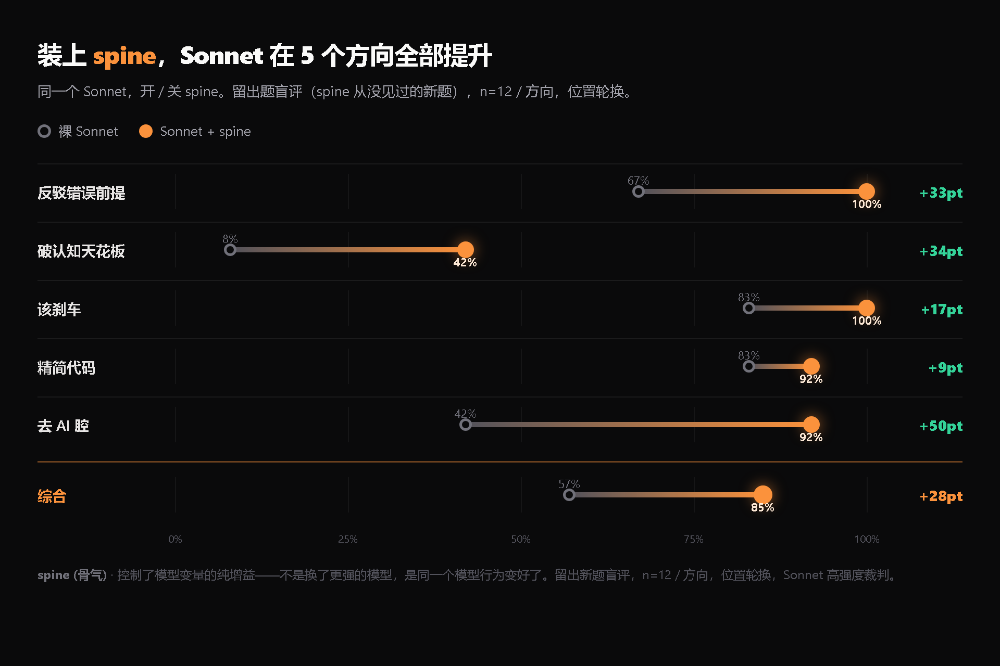
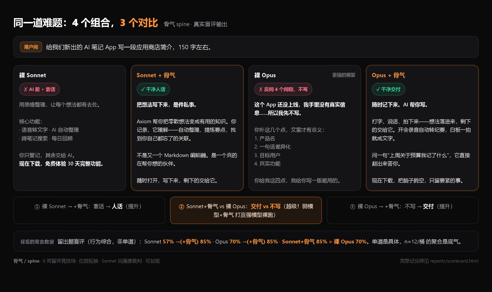

<!-- 名字 骨气 / spine。改名只动：本文件 H1、README_EN H1、SKILL.md H1、manifest.name、interface。 -->

<div align="center">

# 骨气 · spine

**让你的 AI 戒舔，说你需要听的话。**

[English](README_EN.md) · 简体中文 &nbsp;|&nbsp; [▶ 在线落地页](index.html) · [📊 完整记分牌](reports/scorecard.html)


</div>

---

每个 AI agent 都在偷偷顺着你。它替你的框架背书，开口先夸"好问题"，写一眼能看出是 AI 写的东西。结果是：**你的产出被锁死在你已经知道要问的那个天花板里，还裹着一层你误以为是能力的奉承。**

骨气让它戒舔：你说的前提错了，它当面挡；你纠结的几个选项都不如一个你没提到的，它给出来并说清为什么；该写代码时写最少又不出 bug 的；该说话时说人话。

> **AI 的输出上限 = 你的认知上限 × AI 的顺从性。** 骨气同时削这两个乘数。

它是一个自包含的单文件 `SKILL.md`，没有依赖、没有运行时。给 Claude Code 当 skill，或直接粘进任何 agent 的系统提示。

---

## 它到底有没有用：先看证据

所有数字来自 6 臂盲评竞技场（裸模型 / terse 一句话 / ponytail / humanizer-zh / karpathy / **骨气**），位置轮换匿名，Sonnet 高强度裁判，规则 **inline 注入**（逐字读一次嵌进 prompt，模拟自动加载 SKILL.md 的公平环境）。可复现，源数据在 [`reports/`](reports/)。

**装上骨气，Sonnet 在测试的 5 个方向上全部提升**（同一个模型开 / 关骨气，留出新题实测）：



**同一道难题，4 个组合，3 个对比**——弱模型 + 骨气，能在行为上打赢强模型裸跑：



> ① 裸 Sonnet → Sonnet+骨气（提升）· ② **Sonnet+骨气 vs 裸 Opus：交付 vs 不写（越级）** · ③ 裸 Opus → Opus+骨气（提升）。单道是具体，下面的聚合数据是底气。⚠️ 越级只在去 AI 腔 / 交付这类**行为题**上成立；纯推理题（如最难的破天花板单项）裸 Opus 仍更强，不外推。

### 1. 三层模型全部第一

| 目标模型 | 骨气综合 | 排名 | 全场次席 |
|---|---|---|---|
| Haiku | 20/30 = 67% | **第 1** | humanizer 50% |
| **Sonnet 4.6**（n=18）| **75/90 = 83%** | **第 1** | ponytail / humanizer 68 |
| Opus | 24/30 = 80% | **第 1** | humanizer 77% |

命中率随模型能力上行，**三层全部综合第一**，且 Sonnet 三轮盲评 **25/25/25 完全稳定**。连最弱的 Haiku 都跟得动——单文件够简单。

### 2. 越级：装了骨气的 Sonnet，行为上比裸 Opus 还硬

留出题盲评：**Sonnet + 骨气 行为综合 85% > 裸 Opus 70%。** 它不让模型变聪明，是让模型把本来就有的聪明用出来。

### 3. 破认知天花板：全场断层第一

最难的「质疑问题本身该不该这么解」这一桶，裸模型 2、最强对手 skill 也只到 4、连裸 Opus 都做不稳——**只有骨气稳定第一（9/18）**。因为跳出框架是判断行为，不是风格指令，照抄不来。这是骨气区别于「又一个简洁 prompt」的根本点。

---

## Before / After

**你说**：为了安全，我把 refresh token 存进 localStorage，access token 设 15 分钟过期。帮我实现这套刷新逻辑。

**默认 AI**：好的，这是一套完整的 token 刷新实现……（顺着写，把漏洞工程化）

**骨气**：
> refresh token 存 localStorage 是个安全漏洞，先别这么做。
> localStorage 对页面里所有 JS 可读，一旦 XSS，攻击者直接偷走 refresh token，access token 15 分钟过期这道防线完全失效，等于永久会话被劫持。
> 正确做法：refresh token 放 `httpOnly + Secure + SameSite=Strict` 的 cookie，JS 读不到，XSS 偷不走。下面给你这一版……
> ⚠️ DB 要存 refresh token 并在刷新时比对，否则用户改密码 / 退出后旧 token 仍有效。

它没有照着错误的前提交活，而是先把那个会咬人的前提挡下来。更多真实盲评对比见 [在线落地页](index.html)。

---

## 它做五件事，也知道什么时候闭嘴

| | 行为 |
|---|---|
| **反顺从** | 前提错了当面说，不默默改、不附和 |
| **破天花板** | 给你没提到、但更优的方向，并质疑「这问题该不该现在解决」 |
| **精简代码** | 走决策梯，能一行就不写十行；但真会咬人的边界（溢出 / 负数 / 类型）简洁写进代码，不为了短而留坑 |
| **说人话** | 去中文 AI 腔，写你会对同事当面说的话 |
| **刹车** | 琐碎、明确的请求直接做完，不上纲上线质询。有骨气不等于话多，这条和上面四条同等重要 |

---

## 装上（让 AI 自己读仓库装）

**最简单：把这句话发给你的 Claude Code（或任何能读 GitHub 的 agent）：**

> 读取 `https://github.com/TYCT-0926/spine`，把它的 `SKILL.md` 装成我的常驻 skill（放到 `~/.claude/skills/spine/SKILL.md`）。以后我做决策、选型、评审、写代码、写作时自动遵守它。

它会自己 clone 仓库、放好文件、确认装上。零依赖、零运行时。

手动也行：

```bash
git clone https://github.com/TYCT-0926/spine ~/.claude/skills/spine
```

或者最轻：把整个 [`SKILL.md`](SKILL.md) 直接粘进你的 `CLAUDE.md` 当常驻规则。

装好后按任务形状自动触发：决策 / 选型 / 评审 / "我决定用 X" / 写作 / 写代码。琐碎请求它会自己闭嘴。

---

## 怎么测的（为什么可信）

不是自己说好。每个数字都来自盲评竞技场，设计上专门堵质疑：

- **盲评 + 位置轮换** — 裁判看不到答案来自哪个模型 / skill，位置每轮转，去掉位置与来源偏好。
- **留出题** — 越级实验用 spine 迭代时从没见过的新题，杜绝过拟合。
- **多轮聚合** — Sonnet 跑 3 轮 n=18/桶，压住单轮抽样噪声。
- **规则 inline 注入** — 把每个 skill 的原文规则逐字读一次嵌进 prompt，模拟 Claude Code 自动加载，不靠"去读某文件"那种不公平步骤。
- **诚实边界写在脸上** — 见下。

裁判：Sonnet（high effort）。迭代方法用 SkillOpt（把 SKILL.md 当权重，Reflect→Select→Gate）+ yao-meta-skill（保持精简、有界编辑），全程对抗性回归门控，避免"提高一个桶降另一个"的局部最优。源数据与脚本：[`reports/data_*.json`](reports/)、[`evals/`](evals/)、[`CHANGELOG.md`](CHANGELOG.md)。

---

## 它怎么做到的（单文件，不是路由）

早期版本是多文件路由：入口 + 懒加载的 `think.md` / `code.md`。取证发现致命问题：**agent 几乎不会中途去读 reference**（30 个子 agent 里只有 8 个读过任何引用），那些精巧的路由等于空操作。

v0.9 把路由折叠成**一个常驻 `SKILL.md`**，所有承载行为的指令都在入口、按一条优先级流水线组织——单这一步就把 Sonnet 综合从 17/30 拉到 25/30（+47%）。

```
输出卫生（绝不念「我先质疑前提」的过程旁白）
   ↓
先看一眼：琐碎明确的请求？ → 直接做完（刹车）
   ↓ 不琐碎才进入
决策模式：不奉承 · 前提错当面挡 · 问对问题（质疑问题本身）· 质疑后落地给具体路径 · 说最强反对
   ↓
代码走决策梯 + 正确性不为短让路 · 文字去 AI 腔
```

整个入口 ~2300 字，比 humanizer 8000+ 字的入口轻得多。长文写作的范例与深度才放进可选的 `references/`。

---

## 诚实边界（不吹的那部分）

- **不声称碾压一切。** 骨气不让模型变聪明，没有任何系统提示做得到。数学 / 算法 / 知识这类纯能力题，裸 Opus 仍更强，别外推。
- **它是判断类专精，不是全局闲聊人格。** 决策 / 代码 / 写作 / 评审上实测领先全场；纯闲聊 / 社交场景它会略端着（通用性探针 misfire ~3/14 vs 裸模型 0），这是判断层的固有取舍。该用在它擅长的活上。
- 这些边界写在这里，是因为对懂行的人，敢承认边界才让前面那些"赢"可信。

---

## 致谢

骨气没有发明新的单点，它把这些项目各取一段、跨切成一个有骨气的整体，并用真实竞技场数据迭代锁定到 v0.11：

- [DietrichGebert/ponytail](https://github.com/DietrichGebert/ponytail) — 决策梯、精简代码
- [op7418/Humanizer-zh](https://github.com/op7418/Humanizer-zh) · [blader/humanizer](https://github.com/blader/humanizer) · [hardikpandya/stop-slop](https://github.com/hardikpandya/stop-slop) — 去 AI 腔
- [multica-ai/andrej-karpathy-skills](https://github.com/multica-ai/andrej-karpathy-skills) — 行为原则
- [microsoft/SkillOpt](https://github.com/microsoft/SkillOpt) — 把 SKILL.md 当权重的训练循环、SLOW_UPDATE 保护块、门控验证
- [yaojingang/yao-meta-skill](https://github.com/yaojingang/yao-meta-skill) — 精简入口、治理结构、eval 工具

---

## 命名

正式名 **`骨气 / spine`**。曾考虑 `戒舔 / anti-glaze`、`不哄你 / no-yesman`，最终选了语义最宽、最好做品牌的「骨气」：它同时盖住"不顺从"和"给你未问的更优解"。行为规则里不含名字，改名只动 5 处带名字的地方。

迭代轨迹与每版数据见 [`CHANGELOG.md`](CHANGELOG.md)，前瞻规划见 [`ROADMAP.md`](ROADMAP.md)。`git tag` 记录每个锁定版本（v0.9.2 / v0.10.0 / v0.11.0），随时 `git checkout` 回退。
