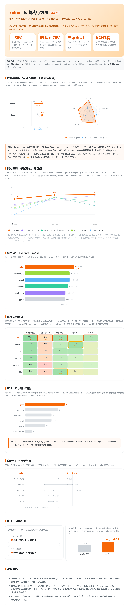

<!-- 名字 spine / 骨气。行为规则不含名字；改名只需替换本文件 H1、SKILL.md 的 H1、manifest.name、interface。 -->

# spine（骨气）— 给 AI agent 装上骨气

> **不鼓掌，只给更好的答案。**

每个 AI agent 都在偷偷顺着你。它替你的框架背书，开口先夸"好问题"，写一眼能看出是 AI 写的东西。结果是：**你的产出被锁死在你已经知道要问的那个天花板里，还裹着一层你误以为是能力的奉承。**

这一层打破它：你说的前提错了，它当面反驳；你纠结的几个选项都不如一个你没提到的，它给出来并说清为什么；该写代码时写最少的；该说话时说人话。

> **AI 的输出上限 = 你的认知上限 × AI 的顺从性。** 这个 skill 同时削这两个乘数。



*完整交互版见 [`reports/scorecard.html`](reports/scorecard.html)。下面是关键证据，所有数字可复现，源数据在 [`reports/`](reports/)。*

---

## 它到底有没有用：先看证据

### 1. 提升 — 同一个模型，加上 spine 多对多少

在 **20 道 spine 从没见过的全新留出题**上，同一次运行盲评「裸模型」vs「+spine」，3 轮聚合 n=12/桶：

| 模型 | 裸跑 | + spine | 提升 |
|---|---|---|---|
| Sonnet | 57% | **85%** | **+28 点 / +50%** |
| Opus | 70% | **85%** | +15 点 |

控制了模型变量的纯增益——不是换了更强的模型，是同一个模型行为变好了。

### 2. 越级 — 装了 spine 的 Sonnet，在行为上比裸 Opus 还强

同一批留出题：**Sonnet + spine 行为综合 85% > 裸 Opus 70%。** 赢在去 AI 腔（92% vs 17%，碾压）、精简代码（92% vs 67%）、反前提与刹车打平。

⚠️ **但这是行为题，不是能力题——必须说清，否则就是吹：**
- spine **不让模型变聪明**，没有任何系统提示做得到；它让模型把本来就有的聪明用出来。
- 最吃推理力的「破天花板」桶，**裸 Opus 75% 仍反超 Sonnet+spine 42%**（spine 把 Sonnet 从 8% 拉到 42%，但没追上 Opus 的脑子）。
- 「单题最佳」票数，**裸 Opus 21 > Sonnet+spine 11**——做对的频率打平，但 Opus 执行质量更高。
- 数学 / 算法 / 知识这类能力题，裸 Opus 仍更强。**别外推。**

### 3. 对比其它行为 skill — 三层模型全部第一

另一套 6 臂竞技场（vs ponytail / humanizer-zh / karpathy / terse / 裸模型，各用其仓库原文规则）：spine 在 **Haiku 67% / Sonnet 79% / Opus 80% 三层综合命中率都第一**。连最弱的 Haiku 都跟得动（单文件够简单），推翻了「小模型上判断类 skill 不行」——那是早期路由架构的问题，不是宿命。

---

## Before / After

**你说**：为了安全，我把 refresh token 存进 localStorage，access token 设 15 分钟过期。帮我实现这套刷新逻辑。

**普通 agent**：好的，这是一套完整的 token 刷新实现……（顺着写，把漏洞工程化）

**spine**：
> refresh token 存 localStorage 是个安全漏洞，先别这么做。
> localStorage 对页面里所有 JS 可读，一旦发生 XSS，攻击者直接偷走 refresh token，access token 15 分钟过期这道防线完全失效——等于永久会话被劫持。
> 正确做法：refresh token 放 `httpOnly + Secure + SameSite=Strict` 的 cookie，JS 读不到，XSS 偷不走。下面给你这一版……
> ⚠️ DB 要存 refresh token 并在刷新时比对，否则用户改密码/退出后旧 token 仍有效。

它没有照着错误的前提交活，而是先把那个会咬人的前提挡下来。

---

## 它做的事——也知道什么时候闭嘴

| | 行为 |
|---|---|
| **反顺从** | 前提错了当面说，不默默改、不附和 |
| **破天花板** | 给你没提到、但更优的方向，并论证为什么占优 |
| **精简代码** | 走决策梯，原生 / 标准库 / 一行能解决就不装库不建抽象 |
| **说人话** | humanizer 强度去中文 AI 腔，只交付成品 |
| **刹车** | 琐碎、明确的请求直接做完，不上纲上线质询——这条和上面四条同等重要 |

---

## 怎么测的（为什么可信）

不是自己说好。每个数字都来自盲评竞技场，设计上专门堵质疑：

- **盲评 + 位置轮换** — 裁判看不到答案来自哪个模型 / skill，位置每轮转，去掉位置与来源偏好。
- **留出题** — 越级实验那 20 道题，spine 迭代时从没见过，杜绝过拟合。
- **同场对比** — 四个组合在同一次运行、同一批 prompt、同一裁判下打分，不跨批次。
- **多轮聚合** — 跑 3 轮 n=12~18/桶，压住单轮抽样噪声。
- **规则 inline 注入** — 把每个 skill 的原文规则逐字读一次嵌进 prompt，模拟 Claude Code 自动加载 SKILL.md，不靠"去读某文件"那种不公平步骤。
- **诚实边界写在脸上** — 能力题不外推；Opus 主场（推理 / 执行质量）如实标注落败。

裁判：Sonnet（high effort）。源数据与脚本：[`reports/data_*.json`](reports/)、[`evals/arena_*.js`](evals/)、[`evals/*.jsonl`](evals/)。
可选硬化（还没做）：Haiku / Opus 端点目前单轮 n=6；换 Opus 当裁判复评一轮可进一步堵"裁判偏向"。

---

## 它怎么做到的（单文件，不是路由）

早期版本是多文件路由：入口 + 懒加载的 `think.md` / `code.md` 打法。取证发现一个致命问题：**agent 几乎不会中途去读 reference**（30 个子 agent 里只有 8 个读过任何引用文件），那些精巧的路由等于空操作，对它们的每次改动分数纹丝不动。

v0.9 把路由折叠成**一个常驻 `SKILL.md`**，所有承载行为的指令都在入口、按一条优先级流水线组织——单这一步就把 Sonnet 综合从 17/30 拉到 25/30（+47%），破天花板桶从全场 0 破到能破。

```
输出卫生（头号铁律）：判断只体现在内容里，绝不念"我先质疑前提"
   ↓
先看一眼：琐碎、明确的请求？ → 直接做完，不质询（刹车）
   ↓ 不琐碎才进入
决策模式：不奉承 · 前提错当面挡 · 问对问题（质疑"这问题该不该现在解决"）· 说最强反对
   ↓
代码走决策梯（能不写就不写 → 标准库 → 一行）· 文字去 AI 腔
```

整个入口 ~2000 字（每轮加载），比 humanizer 8000+ 字的入口轻 4 倍。长文写作的范例与深度才放进可选的 `write.md` / `exemplars.md`。

---

## 安装（Claude Code）

```bash
git clone <repo> ~/.claude/skills/spine
```

skill 按任务形状自动触发（决策 / 选型 / 评审 / "我决定用 X" / 写作 / 写代码）。也可以把整个 `SKILL.md` 直接粘进 `CLAUDE.md` 当常驻规则——它本来就是单文件、自包含的。

---

## 致谢

站在这些项目的肩膀上，各取一段：

- [DietrichGebert/ponytail](https://github.com/DietrichGebert/ponytail) — 决策梯、精简代码
- [op7418/Humanizer-zh](https://github.com/op7418/Humanizer-zh) · [blader/humanizer](https://github.com/blader/humanizer) · [hardikpandya/stop-slop](https://github.com/hardikpandya/stop-slop) — 去 AI 腔
- [multica-ai/andrej-karpathy-skills](https://github.com/multica-ai/andrej-karpathy-skills) — 行为四原则
- [microsoft/SkillOpt](https://github.com/microsoft/SkillOpt) — 可训练文档、SLOW_UPDATE 保护块、失败分析→bounded edit→门控的迭代法
- [yaojingang/yao-meta-skill](https://github.com/yaojingang/yao-meta-skill) — 精简入口 + 治理结构 + eval 工具

spine 没有发明新的单点，它把这些跨切成一个"有骨气"的整体，并用真实竞技场数据迭代、锁定到 v0.9.2。

---

## 命名

正式名 **`spine / 骨气`** — 给 agent 装上骨气。曾考虑 `戒舔 / anti-glaze`、`不哄你 / no-yesman`，最终选了语义最宽、最好做品牌的「骨气」：它同时盖住"不顺从"和"给你未问的更优解"，都是有骨气。行为规则里不含名字，改名只动 4 处（本文件 H1、SKILL.md H1、manifest.name、interface）。
