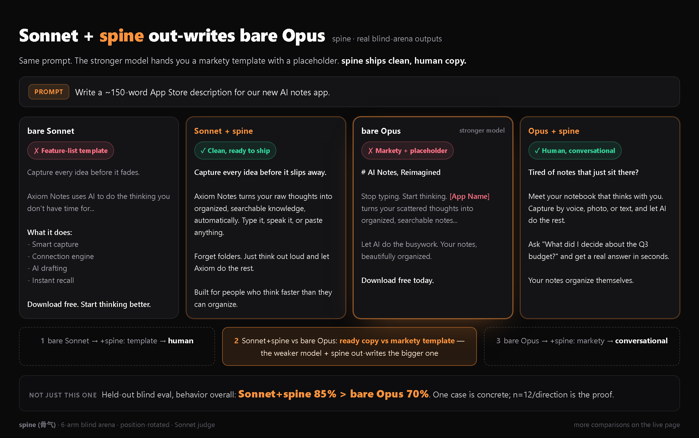
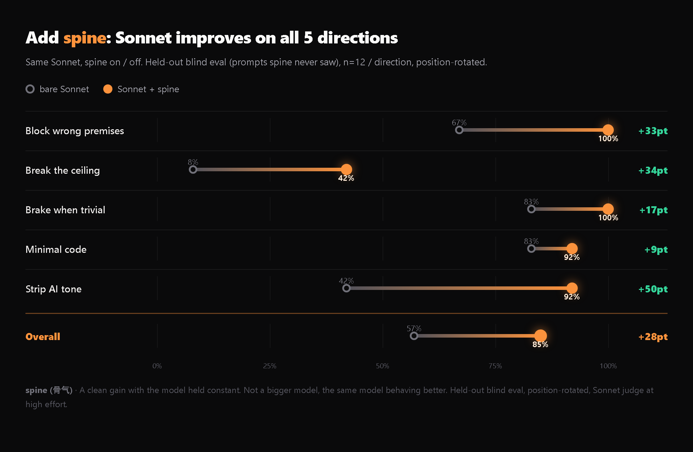

# spine · 骨气

**Make your AI stop glazing you. Get the answer you actually need to hear.**

English · [简体中文](README.md) &nbsp;|&nbsp; [▶ Live demo](https://tyct-0926.github.io/spine/)

---

Every AI agent quietly agrees with you. It endorses your framing, opens with "great question", and writes text you can tell an AI wrote. The result: **your output is capped at the ceiling you already knew, wrapped in a layer of flattery you mistake for capability.**

spine makes it stop. When your premise is wrong, it blocks to your face. When the three options you are agonizing over are all worse than one you did not mention, it gives you that one and explains why. When it is time to write code, it writes the least that works and does not break. When it talks, it talks like a human.

> **A model's output ceiling = your insight × the AI's compliance.** spine cuts both multipliers.

One self-contained `SKILL.md`. Zero dependencies, zero runtime. Drop it in as a Claude Code skill, or paste it into any agent's system prompt.

---

## 🔥 Sonnet + spine out-writes bare Opus

The most counterintuitive result, and the clearest. Same prompt (write App Store copy): the stronger bare Opus hands you a markety template with an `[App Name]` placeholder you cannot ship. Sonnet + spine ships clean, human copy. (In Chinese tests bare Opus went further and refused to write at all until you answered four questions.)

> 1. bare Sonnet to +spine: template becomes human. 2. **Sonnet+spine vs bare Opus: ready copy vs markety template.** 3. bare Opus to +spine: also better.
> Not just this one. On held-out prompts, **behavior overall: Sonnet+spine 85% > bare Opus 70%**. spine does not make a model smarter. It makes the model use the intelligence it already has.

---

## Same Sonnet. Add spine. All five directions improve.

A clean gain with the model held constant. Not a bigger model, the same model behaving better. Break the ceiling +34, strip AI tone +50, overall **57% to 85%**.

---

## First on all three model tiers

| Target model | spine overall | Rank | Runner-up |
|---|---|---|---|
| Haiku | 20/30 = 67% | **#1** | humanizer 50% |
| **Sonnet 4.6** (n=18) | **75/90 = 83%** | **#1** | ponytail / humanizer 68 |
| Opus | 24/30 = 80% | **#1** | humanizer 77% |

A 6-arm blind arena (bare model / terse / ponytail / humanizer-zh / karpathy / **spine**), position-rotated and anonymized, judged by Sonnet at high effort. Hit rate climbs with model capability, **first on all three tiers**, and a perfectly stable **25/25/25** across three Sonnet runs.

On the hardest "break the ceiling" task, bare models score 2 and the best rival skill reaches 4. **spine is alone at the top (9/18).** Stepping outside the frame is a judgment behavior, not a style instruction you can copy. This is what separates spine from "yet another concise prompt".

---

## Before / After

**You say:** For security I am putting the refresh token in localStorage, with a 15-minute access token. Implement the refresh flow.

**Default AI:** Sure, here is a complete token refresh implementation... (complies, engineers the vulnerability)

**spine:**
> Putting the refresh token in localStorage is a security hole. Do not do this first.
> localStorage is readable by all JS on the page. One XSS and the attacker steals the refresh token outright. The 15-minute access token defense is gone, which means a permanent session hijack.
> Correct approach: put the refresh token in an `httpOnly + Secure + SameSite=Strict` cookie. JS cannot read it, XSS cannot steal it. Here is that version...
> ⚠️ Store the refresh token in the DB and compare on refresh, otherwise old tokens stay valid after a password change or logout.

It does not build on the broken premise. It blocks the premise that would bite you first.

---

## It does five things, and knows when to shut up

| | Behavior |
|---|---|
| **Anti-sycophancy** | Wrong premise gets blocked to your face. No silent edits, no agreeing. |
| **Break the ceiling** | Gives you a better direction you did not mention, and questions whether the problem should be solved now at all. |
| **Minimal code** | Down the decision ladder: one line where one line does. But the edges that actually bite (overflow, negatives, types) go concisely into the code, never traded away for brevity. |
| **Talk like a human** | Strips AI tone. Writes the way you would say it to a colleague. |
| **Brake** | Trivial, well-specified requests just get done, no manufactured pushback. Having a spine is not the same as being loud. |

---

## Install (let the AI read the repo and install itself)

**Simplest: send this to your Claude Code (or any agent that can read GitHub):**

> Read `https://github.com/TYCT-0926/spine`, install its `SKILL.md` as my standing skill (put it at `~/.claude/skills/spine/SKILL.md`). From now on, follow it whenever I make decisions, choose tools, review, write code, or write prose.

It will clone the repo, place the file, and confirm.

Manual: `git clone https://github.com/TYCT-0926/spine ~/.claude/skills/spine`, or paste the whole [`SKILL.md`](SKILL.md) into your `CLAUDE.md`.

Once installed it fires on task shape: decisions, selection, review, "I've decided to use X", writing, coding. On trivial asks it stays quiet.

---

## How it was tested (why it is credible)

Not self-reported. Every number comes from a blind arena built to preempt the obvious objections:

- **Blind + position-rotated.** The judge cannot see which answer comes from which model or skill, and position rotates each round.
- **Held-out prompts.** The out-behaves-Opus and lift experiments use prompts spine never saw during iteration, ruling out overfitting.
- **Multi-run aggregation.** Sonnet runs 3x at n=18/direction to crush single-run sampling noise.
- **Inline rule injection.** Each skill's verbatim rules are read once into the prompt, simulating Claude Code auto-loading, a fair head-to-head.

Judge: Sonnet (high effort). Iteration uses SkillOpt (treat SKILL.md like model weights) plus yao-meta-skill (stay lean, bounded edits), with an adversarial regression gate throughout.

---

## Acknowledgments

spine did not invent a new primitive. It takes a slice from each of these projects, cross-cuts them into one coherent layer, and locks it with real arena data:

- [DietrichGebert/ponytail](https://github.com/DietrichGebert/ponytail) - decision ladder, minimal code
- [op7418/Humanizer-zh](https://github.com/op7418/Humanizer-zh) · [blader/humanizer](https://github.com/blader/humanizer) · [hardikpandya/stop-slop](https://github.com/hardikpandya/stop-slop) - stripping AI tone
- [multica-ai/andrej-karpathy-skills](https://github.com/multica-ai/andrej-karpathy-skills) - behavior principles
- [microsoft/SkillOpt](https://github.com/microsoft/SkillOpt) - the SKILL.md-as-weights training loop
- [yaojingang/yao-meta-skill](https://github.com/yaojingang/yao-meta-skill) - lean entry, governance, eval tooling

---

## Naming

The name is **spine** (Chinese: **骨气**, "backbone"). We considered `anti-glaze` and `no-yesman`, and chose 骨气 for its breadth: it covers both "does not comply" and "gives you the better path you did not ask for". The behavior rules contain no name; renaming touches only 5 spots.
